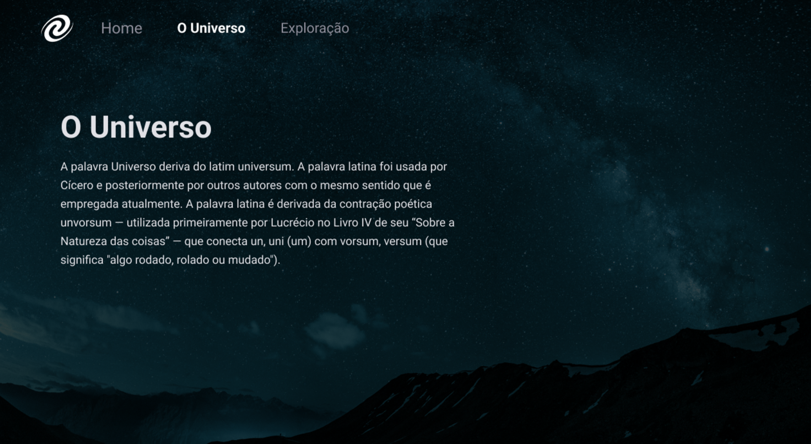

# 🪐 SPA Universe

## 📝 About 

In this challenge the objective is create a application using the concepts studies in the class.

- SPA concepts;
- Route mapping;
- Asynchronous and promises;
- Object orientation;

## 🛠️ Technologies Used

- 🔴 Html
- 🔵 Css
- 🟡 JavaScript

